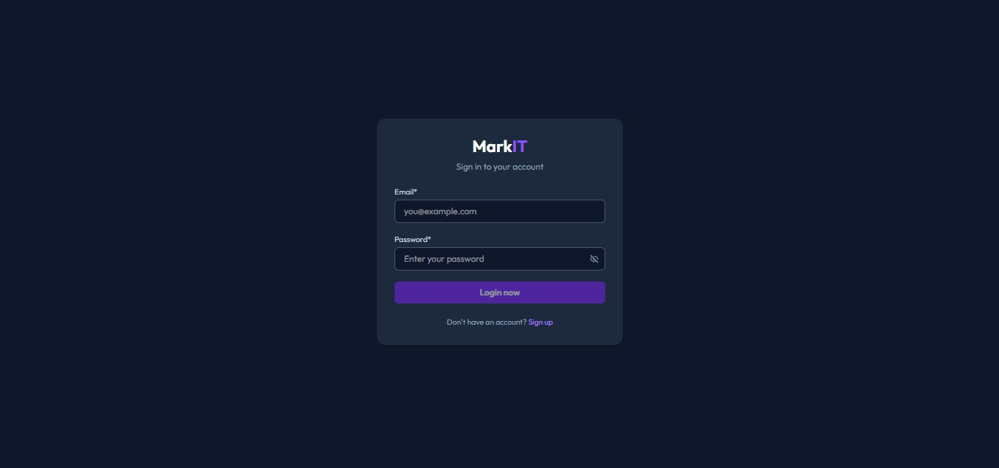
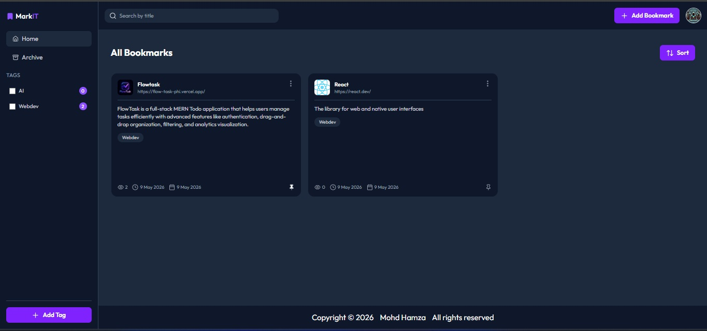
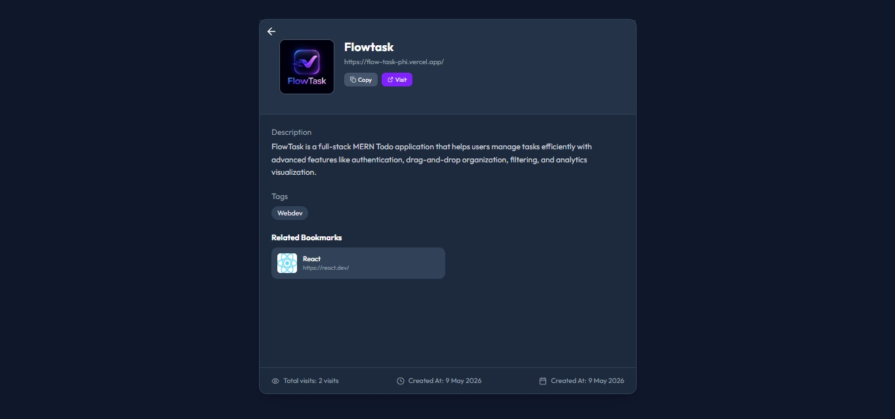
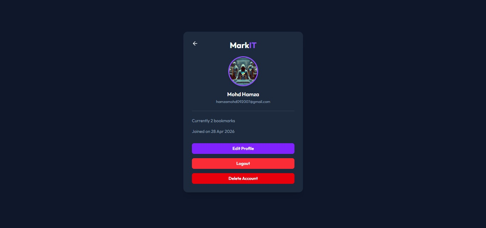
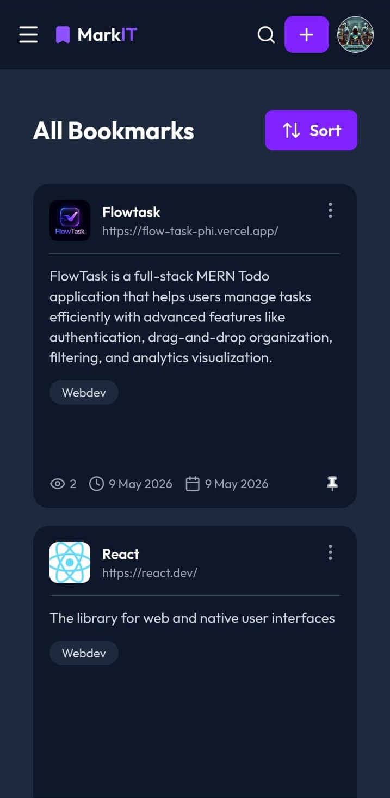

# 🚀 MarkIt

MarkIt is a full-stack MERN Bookmark Manager application that helps users save, organize, and manage bookmarks efficiently with advanced features like authentication, tag filtering, URL previews, pinned bookmarks, and visit tracking.

---

## 📌 Overview

MarkIt allows users to:

- Save and manage bookmarks easily
- Organize bookmarks using tags
- Search bookmarks instantly
- Pin important bookmarks for quick access
- Track bookmark visit counts
- Preview website links before visiting
- Securely manage accounts with authentication

This project focuses on improving productivity and web resource management with a clean and user-friendly interface.

---

## 🛠️ Tech Stack

### Frontend
- React.js

### Backend
- Node.js
- Express.js

### Database
- MongoDB

### Authentication
- JSON Web Token (JWT)
- bcrypt

### Other Tools & Services
- Cloudinary (User avatars & bookmark favicons)
- Vercel (Frontend Deployment)
- Render (Backend Deployment)

---

## ✨ Features

- 🔐 User Authentication (Signup/Login)
- 🔖 Bookmark Management (Create, Update, Delete)
- 🔍 Search Bookmarks
- 🏷️ Tag-Based Filtering
- 📌 Pin Important Bookmarks
- 🌐 URL Preview Support
- 📈 Bookmark Visit Tracking
- 📝 Add Descriptions to Bookmarks
- 🖼️ User Avatar & Bookmark Favicon Support

---

## 📸 Screenshots

### Desktop








### Mobile


---

## 🌐 Live Demo

- Frontend: [MarkIt - Vercel](https://mark-it-murex.vercel.app)
- Backend: [MarkIt - Render](https://markit-ftau.onrender.com)

---

## ⚙️ Installation & Setup

```bash
# Clone the repository
git clone https://github.com/your-username/MarkIt.git

# Navigate to project folder
cd MarkIt

# Install frontend dependencies
cd client
npm install

# Install backend dependencies
cd ../server
npm install

# Run frontend
npm run dev

# Run backend
npm run server
```

## 🔐 Environment Variables

Create a `.env` file in the root and add:

```
PORT=5000
CLIENT_URL=http://localhost:5173
MONGODB_URL=your_mongodb_connection_string
JWT_SECRET=your_jwt_secret
CLOUD_NAME=your_cloudinary_cloud_name
CLOUD_API_KEY=your_cloudinary_api_key
CLOUD_API_SECRET=your_cloudinary_api_secret
```

---

## 🧠 Learnings

- Implemented secure authentication using JWT & bcrypt
- Built a full-stack MERN application
- Learned efficient state and API management
- Implemented dynamic bookmark filtering & search
- Integrated URL previews and visit tracking
- Worked with Cloudinary for media handling

---

## 🚧 Future Improvements

- 📱 Improve mobile responsiveness
- 🔔 Bookmark reminders & notifications
- 📂 Folder/Collection support
- 👥 Bookmark sharing & collaboration
- 🌙 Dark mode support
- 📊 Advanced analytics dashboard
- 🔄 Browser extension integration
- ☁️ Import/Export bookmarks feature

---

## 👨‍💻 Author

**Mohd Hamza**

GitHub: https://github.com/hamzamohd092007

---

## ⭐ Show Your Support

If you like this project, give it a ⭐ on GitHub!
